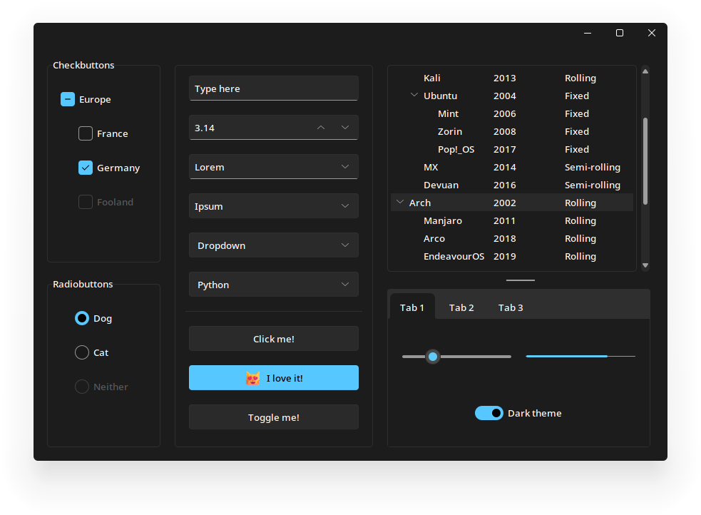

<div align="center">
  
# Sun Valley ttk theme
Make your Tkinter application look better than ever with just two lines of code!



</div>


## Installation [](https://pypi.org/project/sv-ttk)
The theme is easily installable as a Python package

```
pip install sv-ttk
```


## Usage [](https://github.com/rdbende/Sun-Valley-ttk-theme/wiki/Usage-with-Python)
> **Note:**
> 
> The theme will only be applied to themable (`tkinter.ttk`) widgets, and not with the regular Tkinter widgets, they only benefit from the colorscheme.

For detailed documentation, visit the [wiki page](https://github.com/rdbende/Sun-Valley-ttk-theme/wiki/Usage-with-Python).

```python
import tkinter
from tkinter import ttk

import sv_ttk

root = tkinter.Tk()

button = ttk.Button(root, text="Click me!")
button.pack()

# This is where the magic happens
sv_ttk.set_theme("dark")

root.mainloop()
```


## Wanna see more?
Check out my other ttk themes!
- The [Azure ttk theme](https://github.com/rdbende/Azure-ttk-theme)
- The [Forest ttk theme](https://github.com/rdbende/Forest-ttk-theme)
