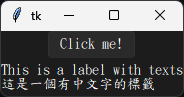
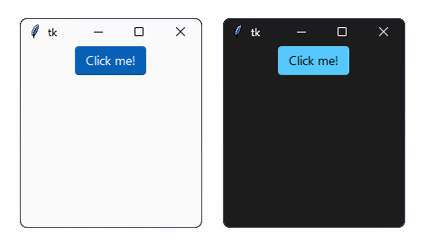

<div align="center">
  
# Sun Valley ttk theme
Make your Tkinter application look better than ever with just two lines of code!


</div>


## Installation
Clone this repo and complie it to applied to your project!

```
python setup.py build
python setup.py install
```

## Usage [](https://github.com/rdbende/Sun-Valley-ttk-theme/wiki/Usage-with-Python)
> [!NOTE]
> The theme will only be applied to themable (`tkinter.ttk`) widgets, and not with the regular Tkinter widgets, they only benefit from the colorscheme.

For detailed documentation, visit the [wiki page](https://github.com/rdbende/Sun-Valley-ttk-theme/wiki/Usage-with-Python).

### Basic usage
This script can apply the default Traditional Chinese OS's fallback list to the sample window
```python
import tkinter
from tkinter import ttk

import sv_ttk

root = tkinter.Tk()

button = ttk.Button(root, text="Click me!")
button.pack()
note_text = ttk.Label(
    root, text="This is a label with texts\n這是一個有中文字的標籤")
note_text.pack(pady=5)

# This is where the magic happens
sv_ttk.set_theme("dark")

root.mainloop()
```
This will draw the window with `Microsoft JhengHei UI(微軟正黑體)` font(First entry of the default fallback font list)  
<div align="center">

  
</div>
  
Default fallback list in the `__init__.py` script:
```python
# Default font list
_prefer_fonts = [
    "微軟正黑體",
    "Microsoft JhengHei UI",
    "蘋方-繁",
    "Noto Sans CJK TC",
    "Segoe UI"
]
```

### Advanced usage
This script defined the custom fallback font list and then draw the window.  
Try to edit the `load_fallback_list` call to make the font suit for your's project!
```python
import tkinter
from tkinter import ttk

import sv_ttk

root = tkinter.Tk()

button = ttk.Button(root, text="Click me!")
button.pack()
note_text = ttk.Label(
    root, text="This is a label with texts\n這是一個有中文字的標籤")
note_text.pack(pady=5)

# Load the fallback fonts like this!
# Don't worry, you can use the non-ascii charters
sv_ttk.load_fallback_list([
    "Font That Does NOT Exist",
    "標楷體",
    "Noto Sans CJK TC",
    "Segoe UI"
])

# This is where the magic happens
sv_ttk.set_theme("dark")

root.mainloop()
```
This will draw the window with `DFKai-SB(標楷體)` font, skip the first font that not avaliable  
<div align="center">



</div>
  
## Tips and tricks
Our intention is to keep the `sv-ttk` package as simple as possible, while making it easy to integrate with other libraries.

### Set the theme to the system theme
You can use the [darkdetect](https://github.com/albertosottile/darkdetect) package to detect the system color scheme. Here's an example:

```python
import darkdetect

sv_ttk.set_theme(darkdetect.theme())
```

It's only a matter of an extra import and passing the result of `darkdetect.theme()` to `sv_ttk.set_theme()`. It's that easy!


### Dark mode title bar on Windows
The Sun Valley theme doesn't change the title bar color on Windows when the theme is set to dark. You can use [pywinstyles](https://github.com/Akascape/py-window-styles) to achieve this. Here's an example:
  
```python
import pywinstyles, sys

def apply_theme_to_titlebar(root):
    version = sys.getwindowsversion()

    if version.major == 10 and version.build >= 22000:
        # Set the title bar color to the background color on Windows 11 for better appearance
        pywinstyles.change_header_color(root, "#1c1c1c" if sv_ttk.get_theme() == "dark" else "#fafafa")
    elif version.major == 10:
        pywinstyles.apply_style(root, "dark" if sv_ttk.get_theme() == "dark" else "normal")

        # A hacky way to update the title bar's color on Windows 10 (it doesn't update instantly like on Windows 11)
        root.wm_attributes("-alpha", 0.99)
        root.wm_attributes("-alpha", 1)

# Example usage (replace `root` with the reference to your main/Toplevel window)
apply_theme_to_titlebar(root)
```

Note that on Windows 10, due to its limitations, you can only set the title bar's color to black for dark mode and white for light mode. On Windows 11 the title bar can be set to any color.


> [!WARNING]
> The `apply_theme_to_titlebar` works on Windows only, so you should check whether the platform is Windows before calling this function.


Here's how the windows look after calling `set_title_bar_color()`:

<details>
  <summary>Screenshots</summary>
  <p align="center">
    <b>Windows 10</b>
    <br>
    
    <br><br>
    <b>Windows 11</b>
    <br>
    
  </p>
</details>


## Wanna see more?
Check out my other ttk themes!
- The [Azure ttk theme](https://github.com/rdbende/Azure-ttk-theme)
- The [Forest ttk theme](https://github.com/rdbende/Forest-ttk-theme)
